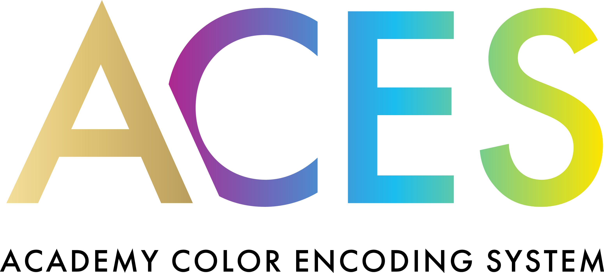

<picture>
  <source media="(prefers-color-scheme: dark)" srcset="./images/aces-full-color-dark.png">
  <source media="(prefers-color-scheme: light)" srcset="./images/aces-full-color-light.png">
  
</picture>

---

The Academy Color Encoding System (ACES) aims to provide a standardized, end-to-end framework for achieving accurate, predictable color reproduction across modern imaging workflows. ACES encodings and transforms are widely adopted across the industry, helping ensure consistent color from capture through post-production, delivery, and long-term archiving.

The ACES-ASWF Github organization hosts the official ACES reference transforms, documentation, and associated projects. Currently these include:

- [aces](https://github.com/aces-aswf/aces) is a "parent" repository used to track tagged ACES releases and to organize the modular components of ACES, which are contained in the following submodules:
    - [aces-core](https://github.com/aces-aswf/aces-core) contains the maths and algorithms that are at the core of the ACES rendering transforms 
    - [aces-amf](https://github.com/aces-aswf/aces-amf) holds the XSD schema and example files for the ACES Metadata File (AMF)
    - [aces-input-and-colorspaces](https://github.com/aces-aswf/aces-input-and-colorspaces) contains color space definitions, mostly camera encodings, and the math to conversions to/from ACES2065-1
    - [aces-output](https://github.com/aces-aswf/aces-output) contains a number of preset transforms set with parameters to correspond with characteristics of standard or common display configurations
    - [aces-look](https://github.com/aces-aswf/aces-look) contains transforms that serve to modify the default appearance of images through an ACES pipeline

- [aces-docs](https://github.com/aces-aswf/aces-docs) contains the files and code used to generate the documentation pages for ACES

## Resources

- Website: <https://acescentral.com>
  - Documentation: <https://docs.acescentral.com>
  - Forum: <https://community.acescentral.com>
- Slack workspace: <https://aswf.slack.com>
  - New users can join via <http://slack.aswf.io>
